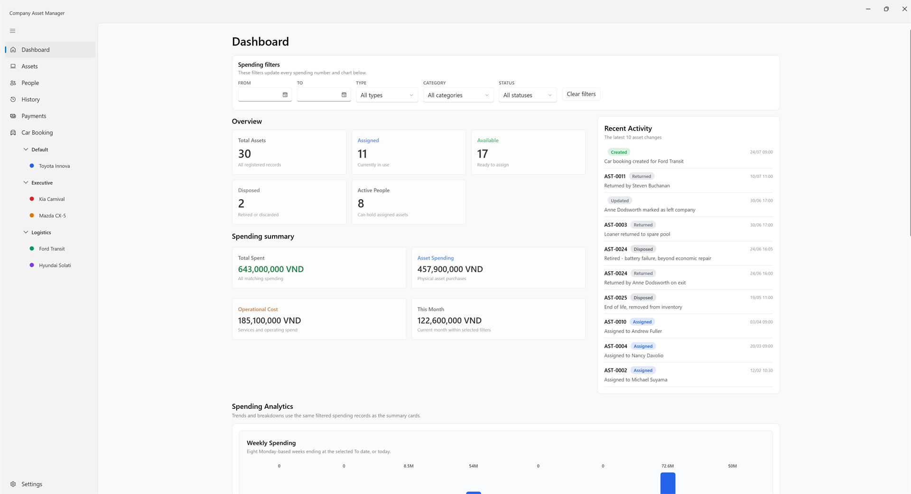
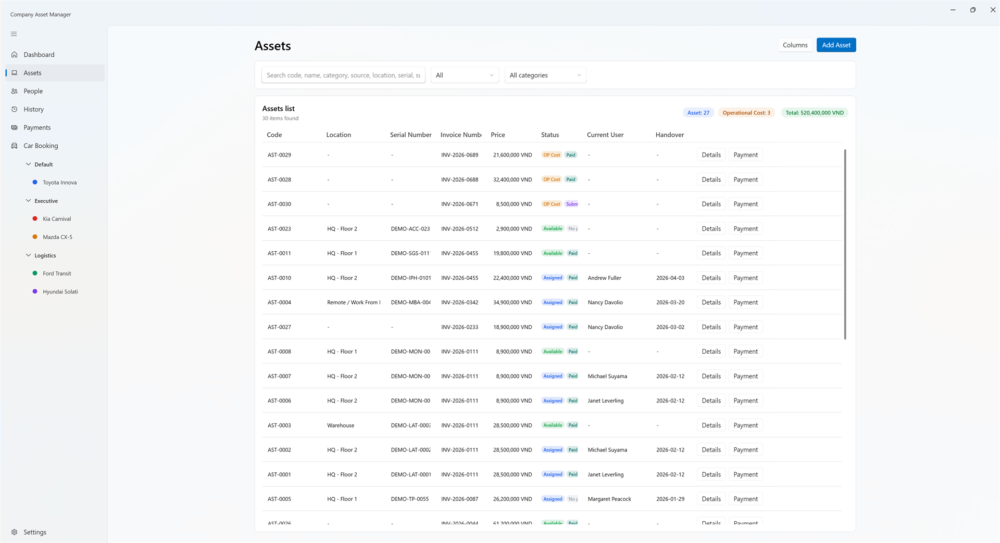
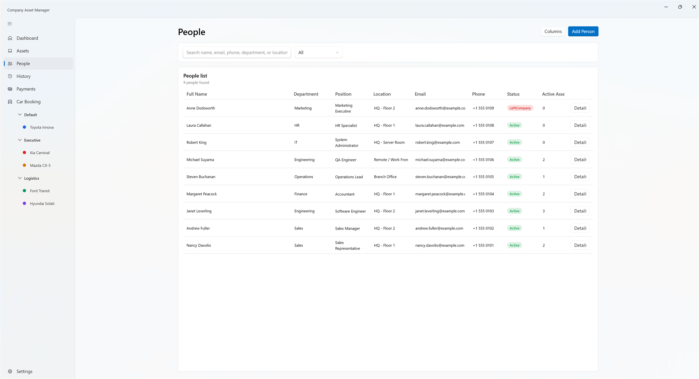
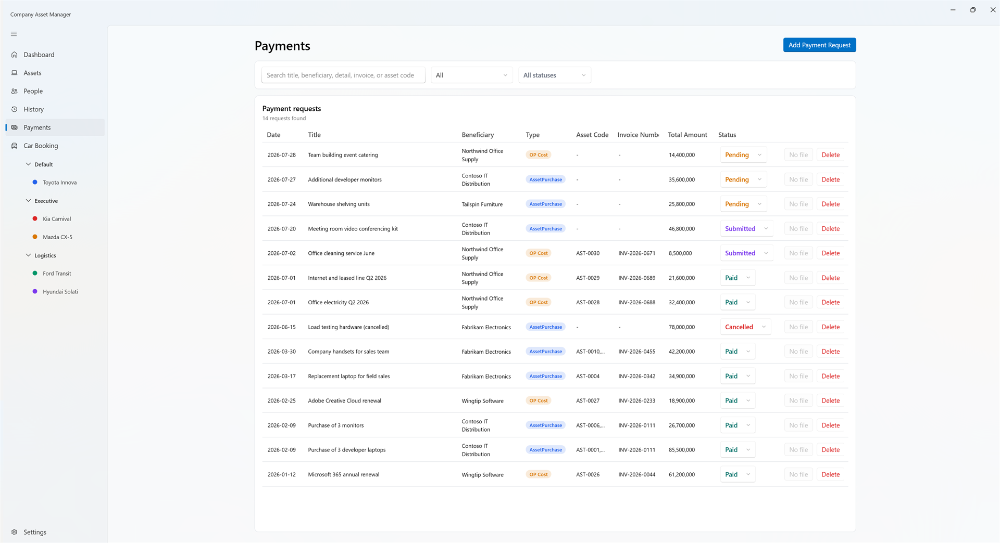
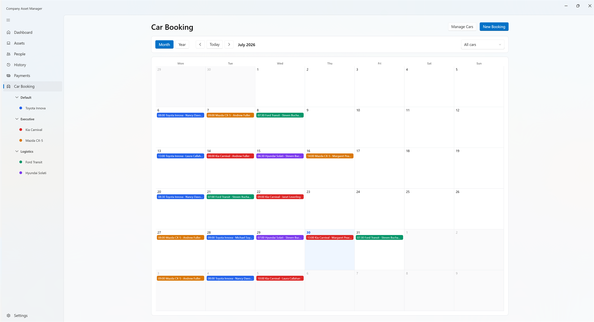
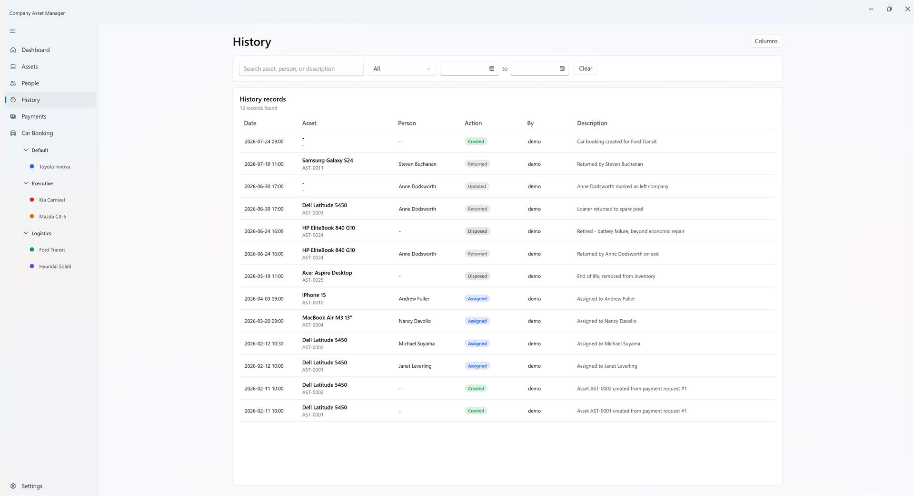
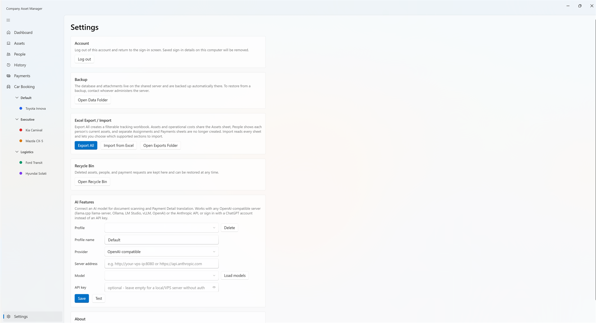
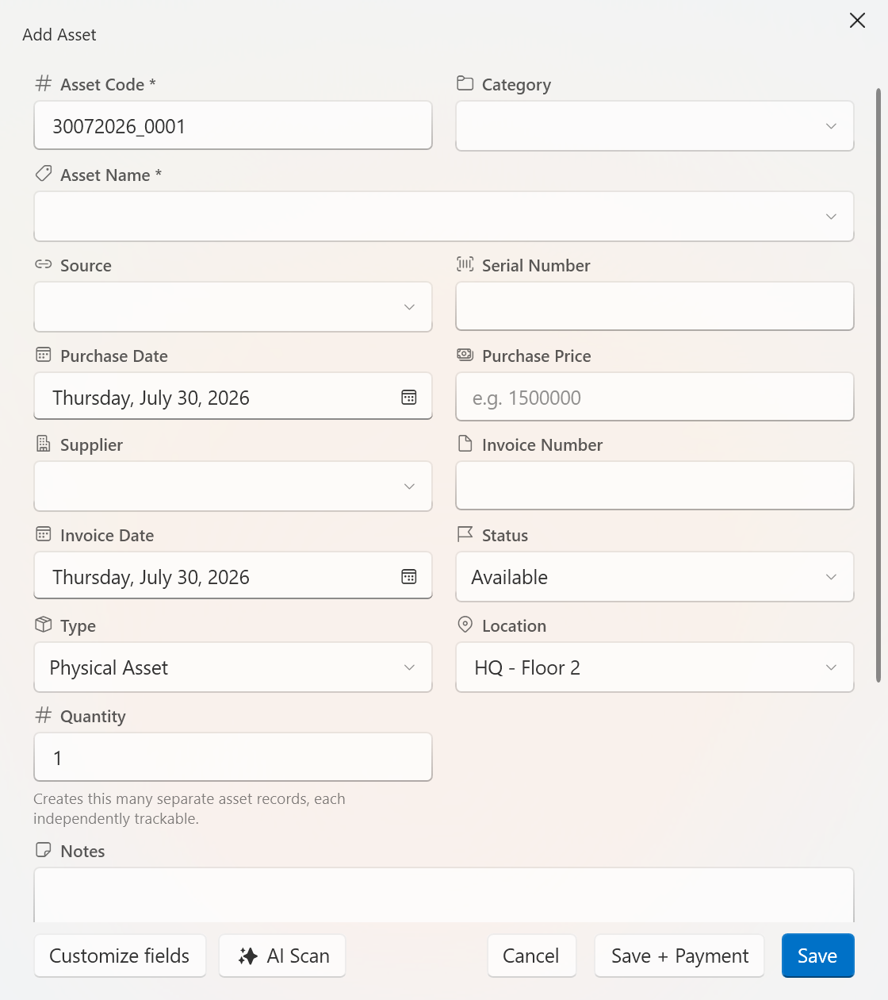

# Company Asset Manager

Windows desktop app for tracking company assets, the people who hold them, purchase/payment requests, and shared vehicle bookings — backed by a shared server so everyone on the team sees the same data in real time.

This repository is the **public release mirror**. It carries no source code: only the packaged Windows build (`product.zip`), the version marker the app's auto-updater reads, and this guide. The source lives in a private repository.

**[⬇ Download the latest release](../../releases/latest)**

---

## Contents

- [What it does](#what-it-does)
- [Install](#install)
- [First run](#first-run)
- [Screens](#screens)
- [Automatic updates](#automatic-updates)
- [Mobile car booking](#mobile-car-booking)
- [AI features (optional)](#ai-features-optional)

---

## What it does

| Area | What you get |
|---|---|
| **Assets** | Register physical assets or operational costs, assign them to people, hand them back, dispose them. Auto-generated asset codes, serial numbers, invoice links, custom column layouts. |
| **People** | Staff directory with department, position, location, and a live count of what each person currently holds. Mark someone as left-company and hand off or return their assets in one step. |
| **Payments** | Purchase and operational-cost requests with beneficiary bank details, linked assets, VAT handling, status workflow, and one-click Excel/PDF generation from your own payment template. |
| **Car Booking** | Shared month/year calendar for company vehicles, grouped by fleet, colour-coded per car. Everyone sees the same bookings instantly. |
| **History** | Every create, assign, return, update, and dispose action, with who did it and when. |
| **Dashboard** | Asset counts, spending totals split between real assets and operating costs, weekly/monthly trends, and category breakdowns — all driven by the same date/type/category filters. |
| **Search** | `Ctrl+K` spotlight search across assets, people, and payments. Case- and accent-insensitive, so `dell` finds *Dell* and `nguyen` finds *Nguyễn*. |
| **Excel** | Export everything to one filterable workbook; re-import it to bulk-load or update records. |
| **Recycle Bin** | Deletes are soft. Assets, people, and payment requests are recoverable for a retention window before permanent cleanup. |

Assets and payment requests are **private to the person who created them**. People and car bookings are **shared across the whole team**.

---

## Install

**Requirements**

- Windows 10 or 11, 64-bit
- Network access to your organisation's Asset Manager server over HTTPS
- An account — accounts are created by whoever administers the server; there is no self-service sign-up
- No .NET install needed. The build is self-contained.

**Steps**

1. Download `product.zip` from the [latest release](../../releases/latest).
2. Right-click the zip → **Properties** → tick **Unblock** → OK. (Windows marks downloaded files as untrusted; skipping this can make the app fail to start.)
3. Extract it to a folder you own and can write to — for example `C:\Apps\CompanyAssetManager`.
   > **Do not** extract into `C:\Program Files`. The app writes to its own folder for cached attachments, exports, and the auto-update swap, and Program Files blocks that.
4. Run `CompanyAssetManager.App.exe`.

**Upgrading an existing install?** Extract over the top of the old folder, keeping `data\`, `exports\`, `attachments\`, and `Payment template\`. Or just let [automatic updates](#automatic-updates) handle it.

**Folder layout after extracting**

```
CompanyAssetManager.App.exe      the app
*.dll                            required runtime libraries — keep all of them
data\                            api-config.json (server address) + your local UI settings
Payment template\                the .xlsx template used to generate payment documents
exports\                         created on first export
attachments\                     local cache of files you open
```

Only one copy runs at a time — launching it again brings the existing window forward.

---

## First run

1. **Sign in** with the username and password your administrator gave you. Tick *Remember me* to keep the sign-in on this computer (stored encrypted, tied to your Windows account).
2. If you see a message about the server address, open `data\api-config.json` and set `BaseUrl` to your server:

   ```json
   {
     "BaseUrl": "https://assets.example.com"
   }
   ```

   Releases normally ship with this already filled in, so you should not have to touch it. If your server uses a private certificate authority, your administrator will also give you a `server-ca.pem` to drop next to the exe and reference as `RootCertificate`.
3. Optional: set up a **payment template**. Put your company's payment-request `.xlsx` in `Payment template\`. Payment documents are generated from it, so the output matches your existing paperwork.
4. Optional: connect an AI model in **Settings → AI Features** — see [below](#ai-features-optional).

> Only `https://` addresses are accepted (plus `localhost` for testing). The app never holds database credentials; it talks only to the API.

---

## Screens

### Dashboard

Asset and spending overview. The filter row at the top drives every number and chart below it, and asset purchases are counted separately from operating costs.



### Assets

Search and filter your asset register. Each row shows status, payment state, who holds it, and the handover date; `Columns` lets you pick and reorder the columns you care about. The totals badge splits real assets from operational costs.



### People

Your staff directory, with each person's active asset count. Open a person to see everything they hold now and everything they held before.



### Payments

Purchase and operational-cost requests with beneficiary, linked asset codes, invoice numbers, and an inline status dropdown. Generated Excel/PDF documents attach to the request.



### Car Booking

Shared vehicle calendar in month or year view. Cars are grouped in the sidebar and colour-coded; bookings appear for everyone the moment they are made.



### History

Full audit trail — what changed, on which asset, for which person, by whom.



### Settings

Account, backup, Excel export/import, Recycle Bin, and AI configuration in one place.



### Add Asset + AI Scan

The asset form remembers your field layout (`Customize fields`) and can pre-fill itself from an invoice or receipt via **AI Scan**. `Save + Payment` creates the asset and its payment request together.



---

## Automatic updates

Updates are hands-off:

1. Every time the main window opens, the app quietly checks this repository for a newer version. No network, no update, or any failure is silently ignored — it never blocks startup or shows an error.
2. If a newer version exists, it downloads and unpacks in the background. You keep working.
3. When it's ready, a blue banner appears: **"Version X ready — Restart to update"**.
4. Click **Restart**. The app closes, swaps itself, and reopens on the new version. That click is the only thing you ever have to do.

Your `data\`, `exports\`, `attachments\`, and `Payment template\` folders are left untouched.

To skip an update, just don't click Restart — you'll be offered it again next launch. To update immediately instead, download `product.zip` from the [latest release](../../releases/latest) and extract over your install.

---

## Mobile car booking

Car Booking is also available as a phone-friendly web page served by the same server, so you can check or make a booking without a Windows machine. Bookings made on the phone appear in the desktop app immediately, and vice versa. Ask your administrator for the URL.

---

## AI features (optional)

Two features can use an AI model, configured in **Settings → AI Features**:

- **AI Scan** — read an invoice, receipt, or PDF and pre-fill an asset or payment form from it.
- **Payment Detail translation** — translate payment descriptions.

Both are off until you configure a profile, and the rest of the app works fully without them. Supported providers:

| Provider | Notes |
|---|---|
| **OpenAI-compatible server** | llama.cpp `llama-server`, Ollama, LM Studio, vLLM, OpenAI itself. Leave the API key empty for a local or in-house server with no auth. |
| **Anthropic API** | Enter your API key. |
| **ChatGPT account** | Sign in with your ChatGPT account instead of using an API key. |

Enter the server address, click **Load models**, pick one, then **Test** before **Save**. You can keep several named profiles and switch between them. API keys are stored encrypted on your own computer.

> Scanned documents are sent to whichever provider you configure. If your documents are sensitive, point this at a self-hosted model.

---

## License

See [LICENSE](LICENSE).
